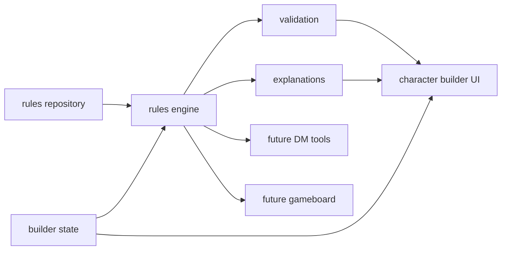

# Architecture Diagram

```mermaid
flowchart LR
  R[rules repository] --> E[rules engine]
  E --> V[validation]
  E --> X[explanations]
  B[builder state] --> E
  B --> UI[character builder UI]
  X --> UI
  V --> UI
  E --> D[future DM tools]
  E --> G[future gameboard]
```
