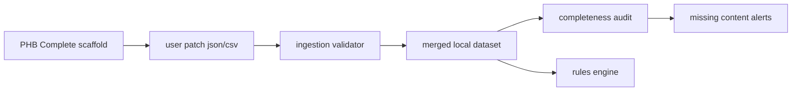

# PHB Ingestion Flow

```mermaid
flowchart LR
  A[PHB Complete scaffold] --> B[user patch json/csv]
  B --> C[ingestion validator]
  C --> D[merged local dataset]
  D --> E[completeness audit]
  D --> F[rules engine]
  E --> G[missing content alerts]
```
