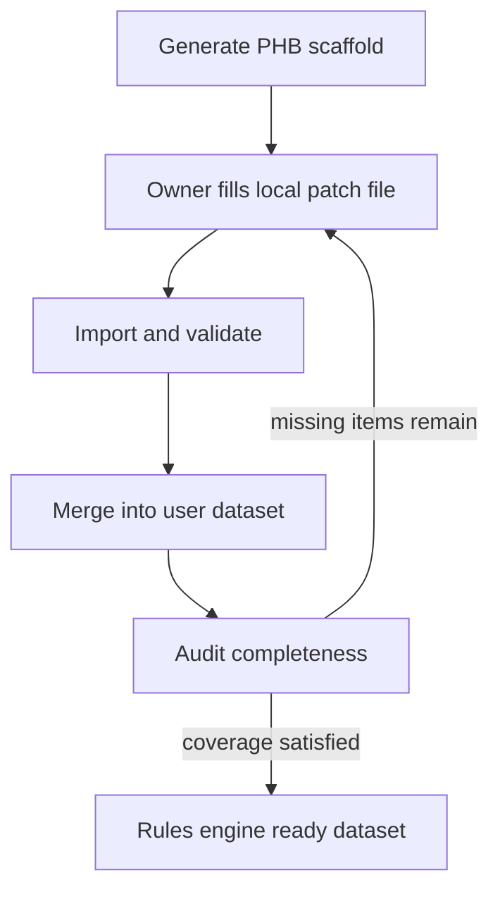

# Completion Loop

```mermaid
flowchart TD
  A[Generate PHB scaffold] --> B[Owner fills local patch file]
  B --> C[Import and validate]
  C --> D[Merge into user dataset]
  D --> E[Audit completeness]
  E -->|missing items remain| B
  E -->|coverage satisfied| F[Rules engine ready dataset]
```
