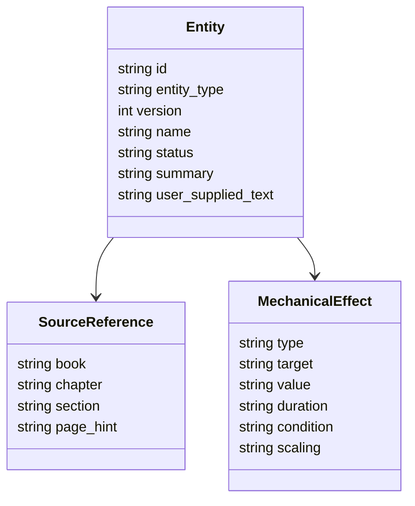

# PHB Entity Model

```mermaid
classDiagram
  class Entity {
    string id
    string entity_type
    int version
    string name
    string status
    string summary
    string user_supplied_text
  }
  class SourceReference {
    string book
    string chapter
    string section
    string page_hint
  }
  class MechanicalEffect {
    string type
    string target
    string value
    string duration
    string condition
    string scaling
  }
  Entity --> SourceReference
  Entity --> MechanicalEffect
```
